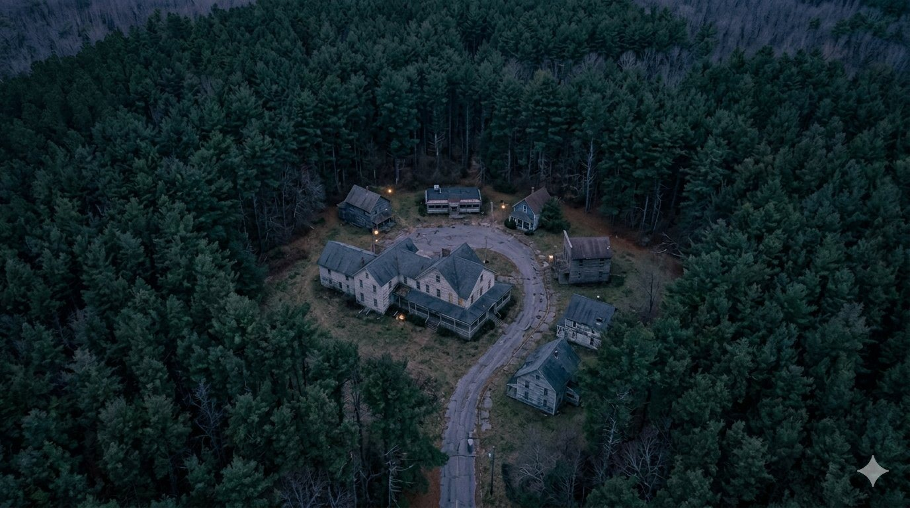
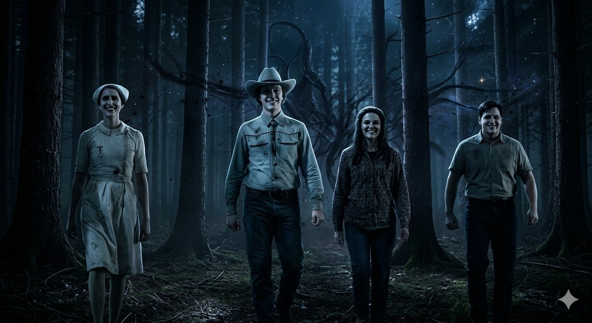
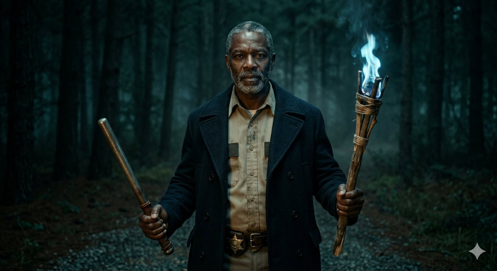
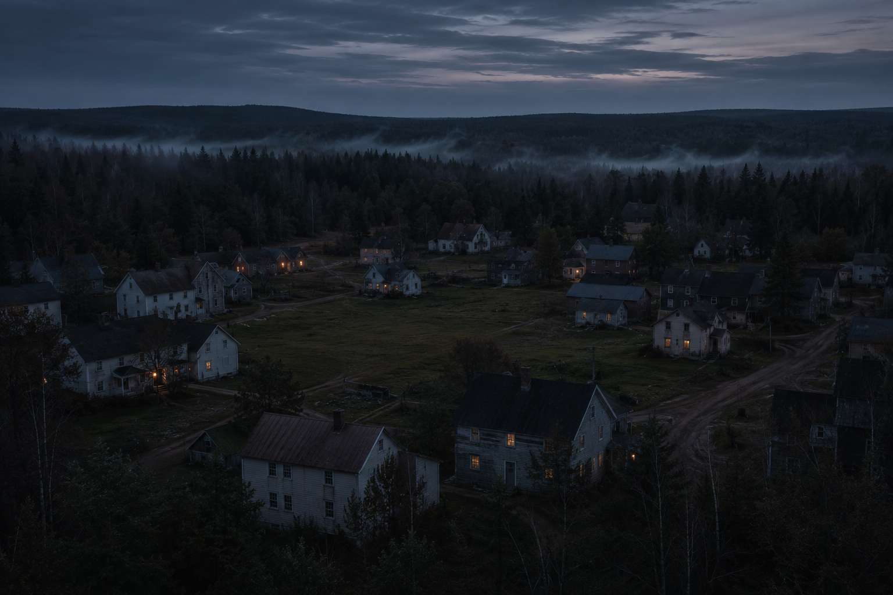
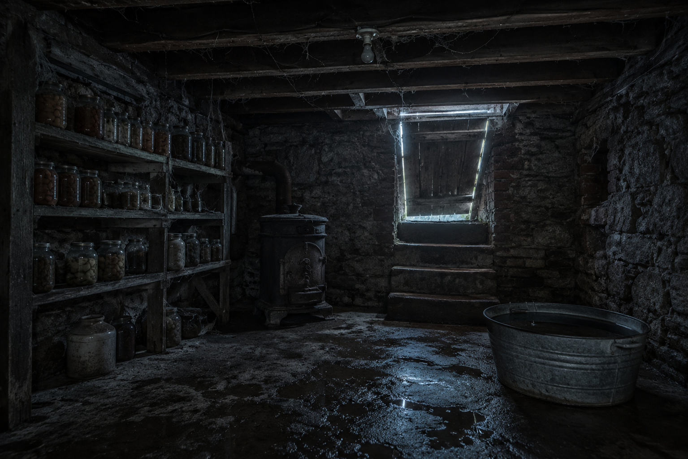
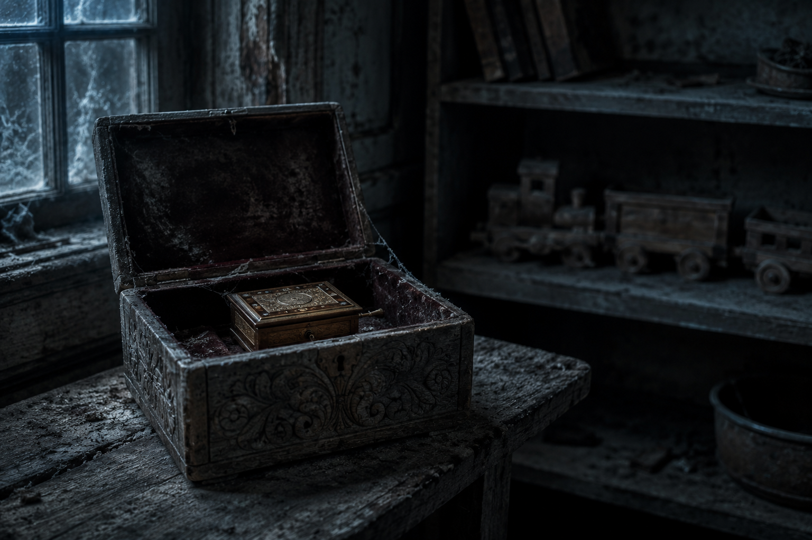
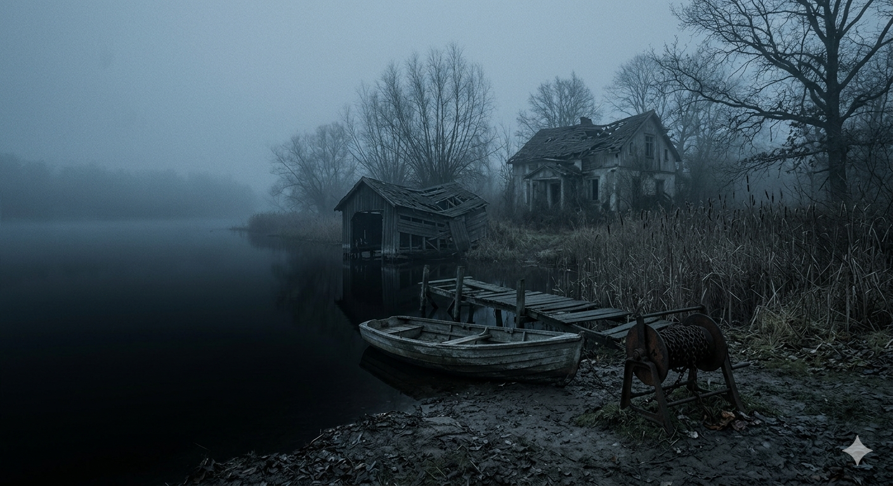
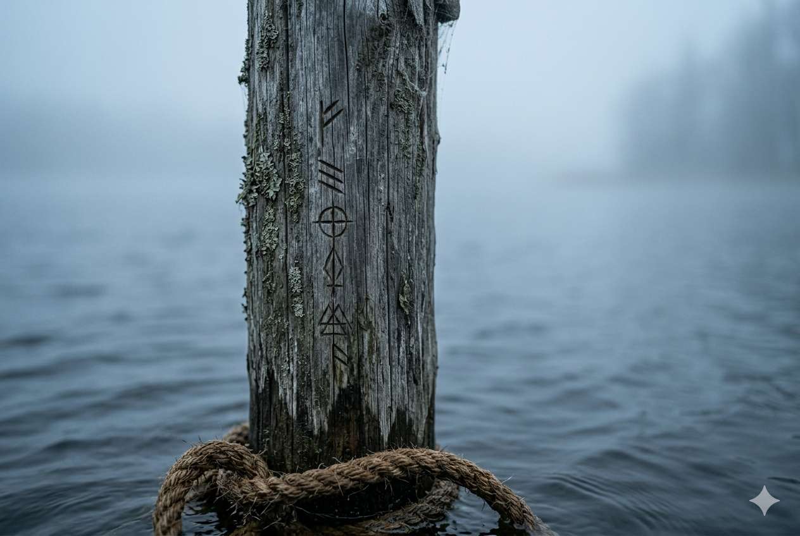

<h1 align="center">FROM — Survive &amp; Solve</h1>

<p align="center">
  <em>A browser-based mystery-survival game inspired by the TV show <strong>FROM</strong>.</em><br>
  <em>An unofficial fan tribute, built as a portfolio piece.</em>
</p>

<p align="center">
  
</p>

<p align="center">
  <strong>Solve a mystery by day. Survive the monsters by night.</strong><br>
  Five levels — and every one is a different kind of game.
</p>

<p align="center">
  <a href="https://nikku2204.github.io/FROM-game/"><strong>▶&nbsp; Play it live</strong></a>
</p>

---

You're trapped in a town that won't let anyone leave — where the forest loops back on itself, and the things that come out after dark wear human faces. You survive one night at a time, as a different resident each time, and the town has a different test waiting for each of them. The only protection is the **talisman**, and it is never given away for free.

<p align="center">
  
  <br><sub><em>It looks like a person. It is not a person.</em></sub>
</p>

## The five nights

Five residents. Five nights. **Every one is a different kind of game** — and working out *which* kind is part of surviving it.

**1 — Boyd ·** _Read the carvings before the dark does._
A symbol is cut into the trees all around the colony, and the sheriff has one afternoon to make sense of it. The people who might help him aren't all telling the truth.

**2 — Tabitha ·** _Hold onto what she shows you._
Tabitha sees things the moment before they happen. Surviving her night comes down to how much of it you can keep hold of.

**3 — Jade ·** _Make it whole, or the night gets in._
The town's oldest protections have come apart in his hands. Putting them back together is the only thing standing between you and what's outside — and it does not get easier.

**4 — Julie ·** _One way out, and the light is going._
Julie follows the children into a house that shouldn't still be standing, and the door locks behind her. Find the way out before nightfall does.

**5 — Victor ·** _The last question._ &nbsp;<sub>(the finale — in the works)</sub>
The town's oldest secret-keeper has been waiting a long time for someone to ask the right thing. The final night isn't about surviving the dark. It's about understanding it.

> Watch the symbols. The same ones keep surfacing, night after night — and they were never just decoration.

## A look inside

<table>
<tr>
<td width="50%"><br><sub><em>The sheriff — and a question he has until sundown to answer.</em></sub></td>
<td width="50%"><br><sub><em>A town whose roads don't lead out.</em></sub></td>
</tr>
<tr>
<td width="50%"><br><sub><em>Some doors only open downward.</em></sub></td>
<td width="50%"><br><sub><em>Whatever's locked away is locked away for a reason.</em></sub></td>
</tr>
<tr>
<td width="50%"><br><sub><em>The far shore, and the fog in between.</em></sub></td>
<td width="50%"><br><sub><em>The symbols again. Always the symbols.</em></sub></td>
</tr>
</table>

## Play

- **Menu** — pick a level. Levels unlock as you survive the one before.
- **By day** — explore, talk to who's left, examine what you find, and keep notes. Time is short.
- **By night** — the test. What the dark asks of you is never the same twice.
- **Sound** — original eerie ambience, synthesized live in the browser. Toggle it bottom-right.

No API key, no backend, no login — it's all static and runs entirely in the browser.

## How it's built

```
FROM-game/
├── index.html          the shell: styles, page, and the script loader
├── engine.js           shared systems — audio, backgrounds, the notebook,
│                        the level menu, and save/progress
├── levels/
│   ├── level1-boyd.js
│   ├── level2-tabitha.js
│   ├── level3-jade.js
│   ├── level4-julie.js
│   └── level5-victor.js     (finale — in progress)
└── assets/             portraits, locations, and scene art
```

One self-contained file per level — each registers itself with the engine and draws its own screens, so every level can be a completely different kind of game while sharing one world, one audio layer, and one save system.

## Adding a level

1. Create `levels/level6-name.js`. At the bottom it registers itself:
   ```js
   Engine.addLevel({ id:"name", num:6, title:"Name",
                     tagline:"A line for the menu", start: bootName });
   ```
   Inside, build your screens with the shared API — `Engine.setBg(...)`, `Engine.render(html)`,
   `Engine.notebook`, `Engine.danger(...)`, `Engine.nightClass(...)` — and call
   `Engine.complete("name")` when the player survives.
2. Add one line to `index.html`:
   ```html
   <script src="levels/level6-name.js"></script>
   ```
3. Done — it shows up in the menu and unlocks after the level before it.

## Host it (GitHub Pages)

1. Upload these files to the repo root (keep the `levels/` and `assets/` folders).
2. **Settings → Pages → Build and deployment → Deploy from a branch → `main` / `root` → Save.**
3. Wait ~1 minute, then visit `https://nikku2204.github.io/FROM-game/`.

Paths are all relative, so it works from the repo's subfolder.

## Art & audio

All imagery is original art generated by the author (via Gemini and similar tools) to evoke the show's world — no real actors, stills, or copyrighted assets. The music is original and synthesized live in the browser. *FROM* is the property of its creators; this is an unofficial fan tribute, not affiliated with or endorsed by them.

## Tech

Vanilla HTML / CSS / JavaScript — no frameworks. Web Audio API for sound. Progress saved via `localStorage` where available. Responsive, and respects `prefers-reduced-motion`.
